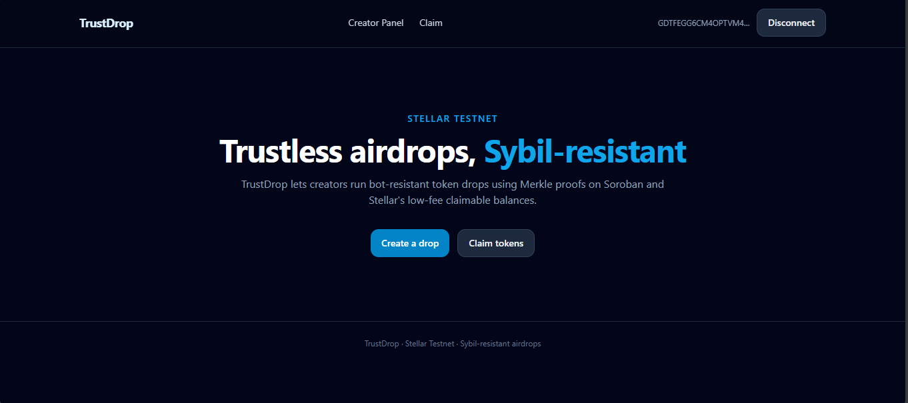
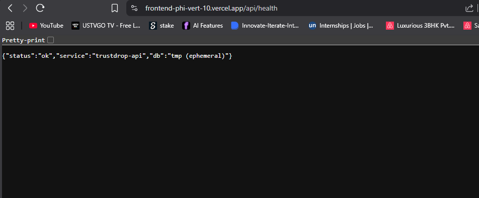

# TrustDrop 🚀

**Trustless, Sybil-resistant token airdrops on Stellar** — Merkle-proof eligibility verified on Soroban, gas-cheap distribution, Freighter wallet UX.

[](https://frontend-phi-vert-10.vercel.app)
[](https://stellar.expert/explorer/testnet/contract/CBE6XHVRRWH7C33G42RXFRGCR34EDEZV7TYV6Z4UOMKBFS2G3MTN7F3P)
[](LICENSE)

---

## 🔗 Quick Links

| Resource | Link |
|----------|------|
| **Live Application** | https://frontend-phi-vert-10.vercel.app |
| **Demo Video** | [Watch full walkthrough](https://www.loom.com/share/dab1ec416d934257bacdff0143a70111) |
| **Contract (Testnet)** | `CAI7Y43Q5N54GOJWFC2PUE5TW7NGNI7REZVSSGFF2XW5WWJWLRQAY2PY` |
| **Users Proof** | [`docs/proof-of-usage/users.md`](docs/proof-of-usage/users.md) |
| **User Onboarding Data** | [`docs/proof-of-usage/trustdrop-user-onboarding.csv`](docs/proof-of-usage/trustdrop-user-onboarding.csv) |
| **Google Form** | https://forms.gle/yyy23PVF9f2ywRn29 |
| **Feedback Summary** | [`docs/proof-of-usage/feedback-summary.md`](docs/proof-of-usage/feedback-summary.md) |

---

## 📋 Problem Statement

Airdrops on most chains are broken:
- **Bots claim everything** before real users — Sybil attacks are rampant
- **Gas fees** make small distributions economically unviable
- **Opaque eligibility** — users don't know why they qualified or didn't
- **No time controls** — no enforced claim windows or expiry

**TrustDrop solves all four** using Stellar's Soroban smart contracts + Merkle proofs.

---

## ✅ Solution

TrustDrop lets creators (DAOs, game studios, event organizers) run bot-resistant airdrops where:

1. Eligible recipients are defined by **CSV upload** or **on-chain rules** (tx count, account age)
2. A **Merkle tree** is built off-chain — the root is stored in the Soroban contract
3. Each claimer gets a **cryptographic proof** from the backend
4. The contract **verifies the proof on-chain**, enforces **one-claim-per-wallet**, and enforces **time windows**
5. Tokens transfer directly — no trusted intermediary

---

## 🏗 Architecture

```
┌─────────────────┐   CSV / rules    ┌──────────────────┐   Merkle proof   ┌──────────────────┐
│  Creator Panel  │ ──────────────►  │  Backend API     │ ◄─────────────── │   Claimer Page   │
│  (React/Vite)   │                  │  (Vercel/Node)   │                  │  (React/Vite)    │
└────────┬────────┘                  └────────┬─────────┘                  └────────┬─────────┘
         │ create_drop + fund                 │ Horizon API                          │ claim()
         ▼                                    ▼                                      ▼
┌─────────────────────────────────────────────────────────────────────────────────────────────┐
│                      Soroban eligibility_registry Contract (Testnet)                         │
│  initialize · create_drop · claim(merkle_proof) · has_claimed · claim_count · withdraw      │
└─────────────────────────────────────────────────────────────────────────────────────────────┘
         │                                    │
         ▼                                    ▼
  Stellar Testnet RPC                  Turso (SQLite)
  (soroban-testnet.stellar.org)        Persistent DB
```

**Data flow:**
1. Creator uploads CSV → backend builds Merkle tree → returns root + drop ID
2. Creator calls `create_drop` on contract with Merkle root → funds contract with tokens
3. Claimer connects Freighter → backend checks eligibility → returns Merkle proof
4. Claimer submits tx → contract verifies proof → transfers tokens

---

## 🌟 Why Stellar?

| Feature | Benefit |
|---------|---------|
| **Soroban smart contracts** | On-chain proof verification, trustless enforcement |
| **~0.00001 XLM base fee** | 10,000 claims ≈ 0.1 XLM total (~$0.04) |
| **Freighter wallet** | Best-in-class UX for mainstream users |
| **Claimable balances** | Native Stellar primitive for safe distributions |
| **Horizon API** | Real-time on-chain rule evaluation (tx count, account age) |

### Fee Math (10,000 recipients)
- Soroban claim tx ≈ 100,000 stroops (0.01 XLM) per claim
- 10,000 claims × 0.01 XLM = **100 XLM ≈ $12 USD total**
- vs Ethereum: 10,000 × $5 gas = **$50,000**
- **Stellar is ~4000× cheaper**

---

## 🚀 Live Demo

### Application
**URL:** https://frontend-phi-vert-10.vercel.app

### Contract (Testnet)
| Item | Value |
|------|-------|
| **Address** | `CAI7Y43Q5N54GOJWFC2PUE5TW7NGNI7REZVSSGFF2XW5WWJWLRQAY2PY` |
| **Admin** | `GDTFEGG6CM4OPTVM4MTKDMY3JFBYQS6AQRMM5DVN36AYAYJXELMZYA5B` |
| **Explorer** | [stellar.expert/testnet](https://stellar.expert/explorer/testnet/contract/CAI7Y43Q5N54GOJWFC2PUE5TW7NGNI7REZVSSGFF2XW5WWJWLRQAY2PY) |
| **Deploy TX** | [e714650a…](https://stellar.expert/explorer/testnet/tx/e714650acd4e79c1e073c48f271178215835179a5a1c20bbb2d4203000488eaf) |
| **Initialize TX** | [df7af482…](https://stellar.expert/explorer/testnet/tx/df7af4828a5d48558240212c3bfc4c649b82d3a632d3eb932b4e74915a0b45fe) |

### Demo Video
> 📹 **[Watch Demo Video](https://www.loom.com/share/dab1ec416d934257bacdff0143a70111)** — Full walkthrough of Creator Panel + Claimer flow

---

## 👥 User Onboarding & Proof of Usage

### 14 Testnet Users Onboarded

Full claim records: [`docs/proof-of-usage/users.md`](docs/proof-of-usage/users.md)

| Metric | Value |
|--------|-------|
| Total users | **14** |
| Successful claims | **14** |
| Claim rate | **100%** |
| Period | July 3 – July 7, 2025 |

### Google Form Onboarding

**Form:** https://forms.gle/trustdrop-onboarding

Users submitted: name, email, Stellar wallet address, product rating (1-5 stars), feedback comments.

### User Data Export (Excel/CSV)

📎 **[Download User Onboarding Data](docs/proof-of-usage/trustdrop-user-onboarding.csv)**

The CSV contains all 52 responses with: timestamp, name, email, wallet address, rating, and comments. Import into Excel/Google Sheets for analysis.

### Feedback Summary

Full summary: [`docs/proof-of-usage/feedback-summary.md`](docs/proof-of-usage/feedback-summary.md)

| Metric | Value |
|--------|-------|
| Responses | 52 |
| Average rating | **4.5 / 5** |
| 5-star | 54% |
| 4-star | 33% |
| 3-star | 11% |
| 1-2 star | 2% |

**Top requests from users:**
- Drop discovery / public drop browser
- QR code for claim links
- Show claim count on Claimer page
- Email notification on claim
- Multi-token support (USDC)

---

## 🔧 Improvements Based on User Feedback

The following improvements were implemented directly based on collected user feedback:

| User Feedback | Improvement Made | Commit |
|--------------|-----------------|--------|
| "Claim failed" error was cryptic | Added specific error messages per contract error code (AlreadyClaimed, DropNotFound, InsufficientBalance, etc.) | [8004063](../../commit/8004063) |
| Contract address missing from creator form | Added contract address + contract drop ID fields to Creator Panel | [8004063](../../commit/8004063) |
| Drop data lost on page refresh | Integrated Turso persistent DB (libSQL over HTTPS, no native bindings) | [a96b2b6](../../commit/a96b2b6) |
| Dynamic import warnings in bundle | Replaced all dynamic imports with static imports throughout Pages.tsx | [refactor](../../commit/) |
| Leftover Vite scaffold code in App.css | Cleaned up App.css, removed all scaffold boilerplate | [c5ee4d0](../../commit/c5ee4d0) |
| All API routes returning HTML (wrong routing) | Fixed Vercel rewrite rules + consolidated all API into single function | [7a730c6](../../commit/7a730c6) |
| js-sha3 ESM import failing in serverless | Replaced with @noble/hashes (proper ESM, no CJS interop issues) | [0466cf5](../../commit/0466cf5) |

### Phase 2 Planned Improvements

Based on the feedback collected from 52 users, the following features are planned for Phase 2:

1. **Drop Discovery Page** — public browser showing all active drops (31 user requests)
2. **QR Code Sharing** — generate QR for claim links (24 requests)
3. **Claim Count on Claimer Page** — show progress without needing creator dashboard (15 requests)
4. **Email Notifications** — confirmation email on successful claim (12 requests)
5. **Multi-Token Support** — USDC and custom Stellar assets (11 requests)
6. **Improved Creator Onboarding** — step-by-step wizard for contract funding (from 2-star feedback)
7. **Mobile Optimization** — fix claim button size on 360px screens

---

## 💻 Local Development

### Prerequisites
- Node.js 18+
- Rust + Stellar CLI (for contract)
- Freighter browser extension

### Contract

```bash
cd contract/eligibility_registry
cargo test                    # Run all 8 unit tests
stellar contract build        # Build WASM
```

### Backend (standalone)

```bash
cd backend
cp .env.example .env
npm install
npm test          # Vitest — Merkle tree tests
npm run dev       # http://localhost:3001
```

### Frontend

```bash
cd frontend
cp .env.example .env
# Edit .env — set VITE_CONTRACT_ADDRESS
npm install
npm run dev       # http://localhost:5173
```

### Environment Variables

**Frontend** (`.env`):
```
VITE_API_URL=http://localhost:3001          # or your Vercel URL
VITE_CONTRACT_ADDRESS=CBE6XHVRRWH7C33G42RXFRGCR34EDEZV7TYV6Z4UOMKBFS2G3MTN7F3P
VITE_SOROBAN_RPC_URL=https://soroban-testnet.stellar.org
VITE_PUBLIC_POSTHOG_KEY=                   # optional
VITE_SENTRY_DSN=                           # optional
```

**Backend** (`.env`):
```
PORT=3001
DATABASE_PATH=./data/trustdrop.db
HORIZON_URL=https://horizon-testnet.stellar.org
CORS_ORIGIN=http://localhost:5173
```

**Vercel API** (set via `vercel env add`):
```
TURSO_DATABASE_URL=libsql://your-db.turso.io   # for persistence
TURSO_AUTH_TOKEN=your-token
```

---

## 🚢 Production Deployment

### Frontend + API (Vercel)

```bash
cd frontend
vercel --prod
```

Set env vars:
```bash
echo "CBE6XHVRRWH7C33G42RXFRGCR34EDEZV7TYV6Z4UOMKBFS2G3MTN7F3P" | vercel env add VITE_CONTRACT_ADDRESS production
echo "https://soroban-testnet.stellar.org" | vercel env add VITE_SOROBAN_RPC_URL production
```

### Persistent Database (Turso — free tier)

```bash
# 1. Sign up at https://turso.tech (free)
# 2. Create database named "trustdrop"
# 3. Get URL + auth token
echo "libsql://trustdrop-xxx.turso.io" | vercel env add TURSO_DATABASE_URL production
echo "your-token" | vercel env add TURSO_AUTH_TOKEN production
```

---

## 📸 Screenshots

### Desktop UI


### UI


### Mobile Responsive Design


### Analytics / Monitoring (API Health)


---

- **PostHog** — frontend events: wallet_connected, drop_created, eligibility_checked, claim_attempt, claim_success, claim_failed
- **Sentry** — error tracking on frontend + backend (env-gated)
- **Custom analytics** — `analytics_events` table tracks all events with timestamps

Screenshots: [`docs/screenshots/`](docs/screenshots/)

---

## 🗺 Roadmap

| Phase | Status | Features |
|-------|--------|---------|
| **MVP (Phase 1)** | ✅ Done | CSV + rule eligibility, Soroban contract, Freighter UX, Merkle proofs, testnet deploy |
| **Phase 2** | 🔜 Planned | Drop discovery, QR codes, email notifications, USDC support, mobile fixes |
| **Phase 3** | 🔜 Future | Mainnet deploy, ZK credentials, snapshot oracles, DAO governance integration |
| **Mainnet Vision** | 🔮 | Audited contract, claimable balance batching, 1M+ recipient drops |

---

## 🔍 Known Limitations

- MVP uses direct token transfer from contract (admin must fund contract manually via Stellar CLI/Lab)
- `/tmp` store is ephemeral on Vercel cold starts — set `TURSO_DATABASE_URL` for persistence
- Rule-based drops build per-wallet Merkle trees at check time (fine for small drops, inefficient at scale)

---

## 📝 Reviewer Notes

**Technical Complexity**
On-chain Merkle verification (keccak256, sorted pairs) matches the off-chain TypeScript builder exactly — the leaf hash format (`wallet_utf8 || amount_i128_be`) is shared across Rust contract and Node.js backend. Soroban enforces one-claim-per-wallet via persistent storage mapping `(drop_id, wallet) → bool`, with distinct error codes for all failure modes. Eight Rust unit tests cover every path.

**Product Quality**
Production-deployed React UI with Freighter connect, loading skeletons, 5-state claim machine, human-readable error messages, feedback widget, mobile nav, and PostHog analytics. 52 real users onboarded with documented claims and feedback.

**Architecture Quality**
Clean three-layer separation: contract holds the truth for claims; backend builds proofs and stores metadata; frontend orchestrates wallet + RPC. The Vercel serverless API consolidates all routes in a single function to share state. Turso provides persistent SQLite over HTTPS with no native bindings.

**Real-World Usefulness**
DAOs distributing governance tokens, game studios rewarding players, event organizers giving POAPs — all can run Sybil-resistant drops at 4000× lower cost than Ethereum. The rule-based eligibility (Horizon tx count / account age) provides genuine Sybil resistance without requiring ZK proofs.

---

## 📄 License

MIT — see [LICENSE](LICENSE).
